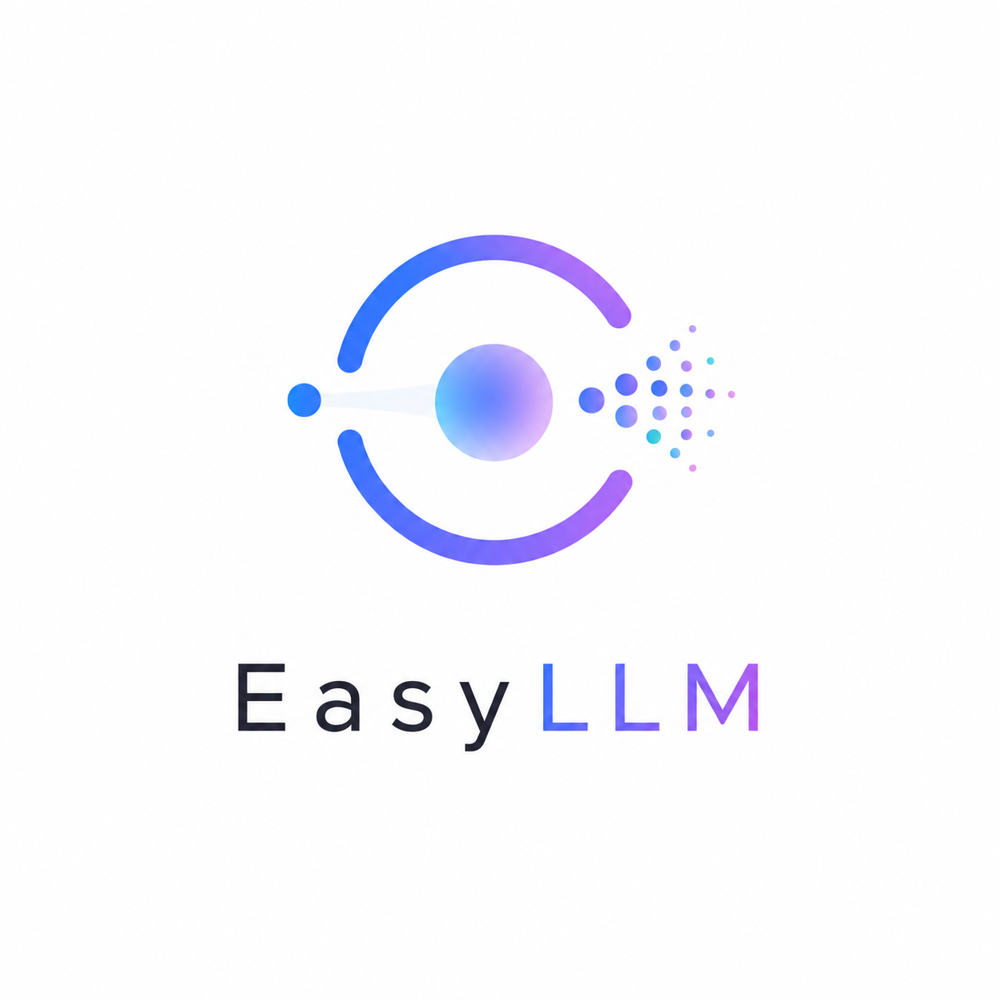

<p align="center">
  
</p>

# EasyLLM

> A from-scratch learning guide to understand and implement multimodal large language models.

## 📚 Overview

This repository is your step-by-step journey to mastering **Multimodal Large Language Models**—where vision, language, and audio converge.

**Why "Easy"?** Because we break down complex concepts into digestible modules, explain every line of code, and build everything from scratch using PyTorch. No magic boxes, just understanding.

### What You'll Learn

- **Core LLM Fundamentals**: Transformers, attention, tokenization, embeddings
- **Training Pipelines**: Data preprocessing, optimization, loss functions
- **Inference & Generation**: Decoding strategies, efficient serving, KV caching
- **Performance Optimization**: Flash Attention, quantization, LoRA fine-tuning
- **Multimodal Magic**: Vision encoders, alignment mechanisms, vision-language fusion
- **End-to-End Models**: Building CLIP, LLaVA, and custom vision-language systems

Perfect for ML engineers who want to *truly understand* how multimodal LLMs work under the hood.

## 🗂️ Repository Structure
├── 01_foundations/
│   ├── tokenization/
│   ├── embeddings/
│   └── attention_mechanism/
├── 02_transformer/
│   ├── self_attention/
│   ├── multi_head_attention/
│   └── transformer_block/
├── 03_language_model/
│   ├── gpt_from_scratch/
│   ├── causal_lm/
│   └── generation.py
├── 04_training/
│   ├── data_pipeline/
│   ├── training_loop/
│   └── optimization/
├── 05_advanced/
│   ├── flash_attention/
│   ├── quantization/
│   └── lora/
├── 06_vision/              # ← Vision encoder basics
│   ├── cnn_encoders/
│   ├── vit/
│   └── visual_features/
├── 07_multimodal/          # ← The heart of EasyLLM
│   ├── clip_from_scratch/
│   ├── alignment/
│   ├── fusion_strategies/
│   └── llava_implementation/
├── 08_inference/
│   ├── batch_generation/
│   ├── kv_cache/
│   └── multimodal_serving/
└── tutorials/              # Guided walkthroughs & explanations

## 📖 Learning Path

1. **Tokenization & Embeddings** → Represent text as numbers
2. **Attention Mechanism** → The core breakthrough
3. **Full Transformer** → Build a language model from scratch
4. **Training LLMs** → Data pipeline, optimization, loss curves
5. **Efficient Inference** → Speed up generation with caching and quantization
6. **Vision Encoders** → Extract visual features from images
7. **Alignment (CLIP)** → Connect vision and language in shared space
8. **Fusion & Integration** → Combine vision + language into one model
9. **Multimodal Models** → Build LLaVA-style chat models
10. **Fine-tune & Deploy** → Adapt to downstream tasks, serve in production

## ⚡ Quick Start

```bash
git clone https://github.com/[your-username]/EasyLLM.git
cd EasyLLM
pip install -r requirements.txt

# Learn by running
python tutorials/01_attention_explained.py
python tutorials/02_gpt_from_scratch.py
python tutorials/07_clip_basics.py          # Vision-language alignment
python tutorials/08_simple_llava.py         # End-to-end multimodal model
```

## 🎯 What Makes EasyLLM Different

✨ **From Scratch** – Build every component; understand every line  
✨ **Principle-Driven** – Learn the *why* behind each design choice  
✨ **Modular** – Master pieces independently, then integrate  
✨ **Production-Ready** – Code is optimized and scalable, not toy examples  
✨ **Multimodal-Focused** – Comprehensive vision-language curriculum  

## 📚 Key Topics & Status

| Topic | Status | Module |
|-------|--------|--------|
| Tokenization & Embeddings | ✅ | `01_foundations` |
| Transformer Architecture | ✅ | `02_transformer` |
| GPT from Scratch | ✅ | `03_language_model` |
| Training Optimization | ✅ | `04_training` |
| Flash Attention 2 | ✅ | `05_advanced` |
| Vision Encoders (CNN, ViT) | ✅ | `06_vision` |
| CLIP: Vision-Language Alignment | ✅ | `07_multimodal` |
| Multimodal Fusion Strategies | ✅ | `07_multimodal` |
| LLaVA-Style Models | ✅ | `07_multimodal` |
| Quantization & Compression | ✅ | `05_advanced` |
| LoRA Fine-tuning | ✅ | `05_advanced` |
| Inference Optimization | 🚧 | `08_inference` |
| Deployment & Serving | 🚧 | `08_inference` |

## 🔗 References & Papers

- Attention Is All You Need (Vaswani et al., 2017)
- CLIP: Learning Transferable Models For Computer Vision Tasks (Radford et al., 2021)
- LLaVA: Large Language and Vision Assistant (Liu et al., 2023)
- Flash-Attention: Fast and Memory-Efficient Exact Attention
- [More papers linked in each module]

## 🤝 Contributing

Issues, PRs, and feedback welcome! Help make EasyLLM the go-to resource.

## 📄 License

MIT

---

**Last Updated**: 2026  
**Next Focus**: Multimodal instruction tuning
